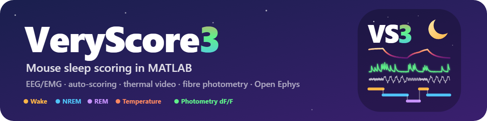
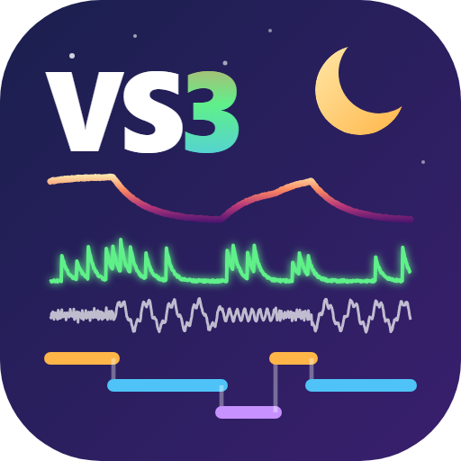

# VeryScore3

**VeryScore3** scores mouse sleep (wake, NREM, REM) in 4-second epochs in MATLAB. It is the continuation of **VeryScore2**, written by Romain Cardis and Anita Lüthi in the Lüthi lab (University of Lausanne), and it reads and writes the same files. New in VeryScore3:

- **Auto-scoring** that learns from scored recordings and adapts to each new one (about 90 % agreement with a human scorer)
- **Thermal video**: the temperature of the animal from an Optris thermal camera, next to the hypnogram
- **Fibre photometry**: dF/F of a photometry channel recorded with the EEG
- **Open Ephys** recordings converted into VeryScore files from the File menu
- **Summary figure** of the whole recording: hypnogram, sigma activity, temperature, photometry, bout durations and states hour by hour

**Get started:** the software and its documentation are in [VeryScore3_For_Sleep_Scoring](VeryScore3_For_Sleep_Scoring/). Add that folder to the MATLAB path and type `VS3_main`.

This repository is a fork of [luthilab/IntanLuthiLab](https://github.com/luthilab/IntanLuthiLab), the Lüthi lab's software for recording and scoring mouse sleep. Their README follows below unchanged, and their other tools are in the other folders. If you use VeryScore in published work, please cite the Lüthi lab (see their citations below and CITATION.cff).

_Dedicated to Romain Cardis and Anita Lüthi, who wrote VeryScore2 and shared it with all of us._

---

# IntanLuthiLab

Welcome to the IntanLuthiLab repository.

This repository belongs to the laboratory of Prof. Anita Lüthi, Department of Fundamental Neurosciences, Faculty of Biology and Medicine, University of Lausanne, Switzerland.

https://dnf-unil.ch/group/gaining-insight-into-the-roles-of-sleep-for-neuronal-function

We share openly here the softwares developed in our lab for recording and scoring electrophysiology data with the Intan recording system. Our hardware setup contains the following parts from IntanTech (https://intantech.com/):

- C3100 RHD USB interface board
- C3211 RHD 1-ft (0.3 m) ultra thin SPI interface cable
- C3314 RHD 32-channel headstage
- C3334 RHD 16-channel headstage

The three softwares proposed here are:

**Symply2Read_For_SleepData_Acquisition**

Used for recording up to 8 animals at a time for long periods.

**VeryScore2_For_Sleep_Scoring**

Used to open, visualize and score the data in three main vigilent state (NREMS, REMS, Wakefulness) obtained with Symply2Read.

 **VeryScore3_For_Sleep_Scoring**

The continuation of VeryScore2 (2026, Alejandro Osorio-Forero): same files, plus an auto-scoring that learns from scored recordings, the temperature of the animal from a thermal video, and fibre photometry dF/F. See its README.
 

**Ypnos_For_Closed_Loop_Experiments**

Used for recording data and automatic detection of the three vigilent states (NREMS, REMS, Wakefulness) using the EMG and EEG signals. This version is related to the experiments conducted in the https://doi.org/10.1038/s41593-024-01822-0 paper.

**Example of an analysis**

This is a little example of the architecture for an analysis on these **bt.mat** files. We provide as well some useful analysis and ease of life functions that we wrote and use in the lab. The analysis and the functions are normally documented and commented to understand their purpose.

_Romain Cardis 2021_

## Citation:

*If you use these softwares and publish work using them, thank you for citing us in your methods.*

Our papers in which we used these tools:

**Thalamic reticular control of local sleep in mouse sensory cortex (2018)**

https://pubmed.ncbi.nlm.nih.gov/30583750/

**Cortico-autonomic local arousals and heightened somatosensory arousability during NREMS of mice in neuropathic pain (2021)**

https://pubmed.ncbi.nlm.nih.gov/34227936/

**Noradrenergic circuit control of non-REM sleep substates (2021)**

https://pubmed.ncbi.nlm.nih.gov/34648731/

**Infraslow noradrenergic locus coeruleus activity fluctuations are gatekeepers of the NREM-REM sleep cycle (2024)**

https://doi.org/10.1038/s41593-024-01822-0

